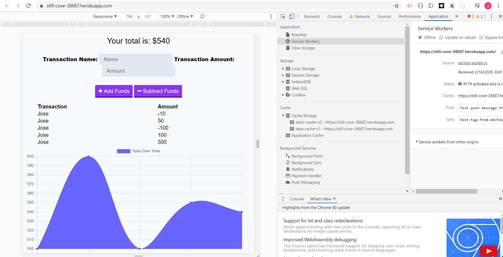

# Budget-Tracker
* GIVEN a user is on Budget App without an internet connection
WHEN the user inputs a withdrawal or deposit
THEN that will be shown on the page, and added to their transaction history when their connection is back online.

* Offline Functionality:

  * Enter deposits offline

  * Enter expenses offline

When brought back online:

  * Offline entries should be added to tracker.

## Usage
* This budget application is meant to track the usage of the user and make sure that they still have funds left.

* This application is also supposed to work while there is no internet connection so that the user can continue to input their expenses or additions to their budget.

* Once the user can access the internet again, the application is to update and take into account the changes done while it was offline.

* This application was a great way to see how to set up the manifest and service workers.

## Screenshots
 * This is the inital page:
 

 * The next two images are after adding two ammounts to the app, after the second addition, the graph is created.
 
 

 * This next screen shot is after subtracting funds:
 

 * Here we see what happens when we set it to offline and refresh, the app still works:
 

 * Next we tried making an addition and subtraction while the app is offline:
 

 * Finally we bring the app back online and refresh the page to see if it was updated:
 